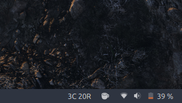
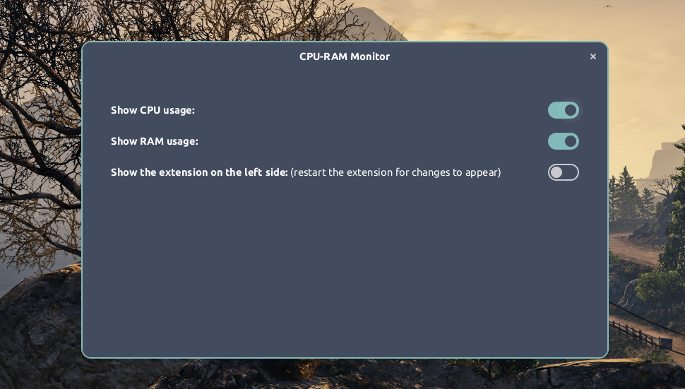

# CPU RAM Monitor

A Gnome extension to Monitor CPU and RAM Usage in an elegant and minimal fashion.

## Table of Contents

* [CPU RAM Monitor](#-CPU-RAM_Monitor)
  * [Table of Contents](#table-of-contents)
  * [Screenshots](#screenshots)
  * [Features](#features)
  * [Getting Started](#getting-started)
    * [Prerequisite: Install Gnome Tweaks](#prerequisite-install-gnome-tweaks)
    <!-- * [Install CPU RAM Monitor from Gnome Extensions](#install-cpu-ram-monitor-from-gnome-extensions) -->
    * [Install CPU RAM Monitor from source](#install-cpu-ram-monitor-from-source)
  * [Contributing](#contributing)
  * [Thanks to](#thanks-to)
  * [License](#license)

## Screenshots


<!--  -->

## Features

This extension has following features:

* Minimal and elegant look
* Percent usage is shown with just one letter
  * C means % CPU usage
  * R means % RAM usage
* If encountered any error, it prints the error in place
   of the extension so that the user if capable can solve it on their own.

## Getting Started

To use this extension, you will need

- Gnome Shell 3.20 or later

### Prerequisite: Install Gnome Tweaks

For Ubuntu,

```bash
sudo add-apt-repository universe
sudo apt install gnome-tweaks
```

For Fedora,

```bash
sudo dnf install gnome-tweaks
```

For Arch Linux,

```bash
sudo pacman -S gnome-tweak-tool
```

You may find Gnome Tweaks for other distributions as well. Install them accordingly.

<!-- ### Install CPU RAM Monitor from Gnome Extensions

Visit [CPU RAM Monitor - GNOME Shell Extensions](https://extensions.gnome.org/extension/4585/CPU-RAM_Monitor/)  -->

### Install CPU RAM Monitor from source

1. Clone this repository

   ```bash
   git clone https://github.com/rishuinfinity/CPU-RAM_Monitor
   ```

2. Change current directory to repository

   ```bash
   cd CPU-RAM_Monitor
   ```

3. Now run

   ```bash
   chmod +x ./install.sh && ./install.sh
   ```

4. Hit `ALT + F2`, Type `r` and hit `Enter`
   
   If you are on Ubuntu wayland mode, then restart once.

5. Open Gnome Tweaks 

6. Enable CPU RAM Monitor extension in Gnome Tweaks

## Contributing

Pull requests are welcome. For major changes, please open an issue first to discuss what you would like to change.

## Thanks to

- This project is modified from [Simple System Monitor](https://github.com/LGiki/gnome-shell-extension-simple-system-monitor) by [LGiki](https://github.com/LGiki)

## License

[GNU General Public License v3.0](LICENSE)

Copyright © 2021- [Rishu Raj](https://github.com/rishuinfinity)
